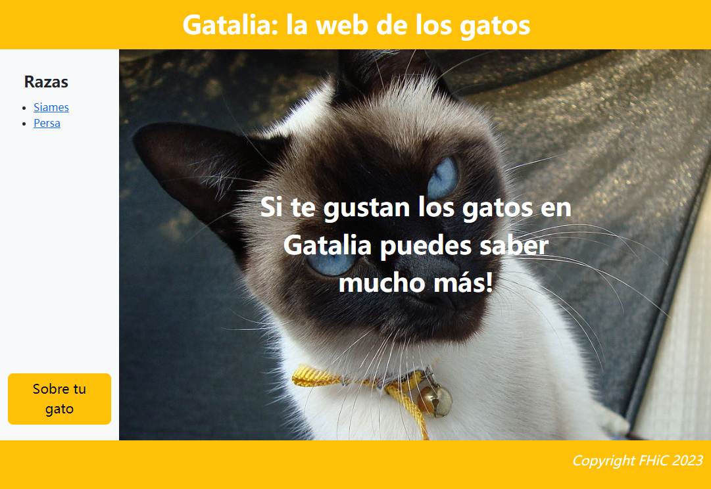
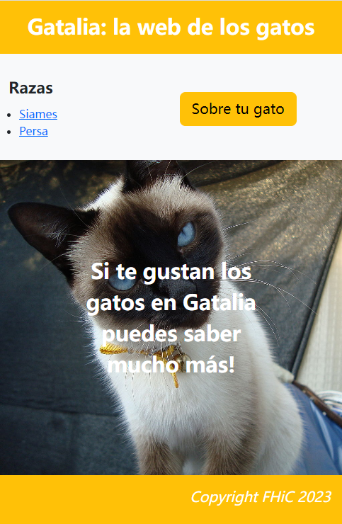

# 
 Factors Humans i Computació

## Version

**refactory with Vue**

## Web

> https://practicasfhic22-23.github.io/html-exercici-1-af9/

## About Web

 

## Contributors

Authors: [@Junjie Li](https://github.com/junjielyu13), [@Manuel Liu Wang](https://github.com/TheExorcit), [@Oscar Jaquero](https://github.com/OscarJaquero).

## Other

IT'S 2023, Bootstrap is a SHIT, please use [tailwindcss](https://tailwindcss.com/).

## License

[MIT](https://github.com/PracticasFHiC22-23/html-exercici-1-af9/blob/main/LICENSE) @ALL CONTRIBUTORS

 ## **Informe sobre los criterios de diseño del formulario.**
 
 ### **STRUCTURE**
 
 Ask only what's required: Aplicat, només demanem les dades necessàries, en aquest cas el nom i l'edat.
 
 Order the form logically: Aplicat, primer es demana el nom i després l'edat.
 
 Group related information: Aplicat, al només tenir nom i edat, pertanyent al grup d'informacio personal.
 
 One column vs multiple columns: One column, el nostre format és d'una columna.
 
 ### **INPUT FIELDS**
 
 Number of fields: Aplicat, només hi tenim dos fields, un pel nom i un altre per l'edat.
 
 Mandatory vs Optional: No ho tenim aplicat
 
 Setting default values: Aplicat, quan es vol introduir informació sobre un nou gat, en el Nom surt com a default en el fons el nom de Mishi, encara que no és un nom aplicat, és a dir, si el donés a guardar sortirà un nom buit i en el cas d'Edat, el seu default és 0.
 
 Input masks: No aplicat.
 
 Desktop-Only: Make form keyboard-friendly: Aplicat, es pot navegar només amb el teclat, si fas tab vas al següent camp.
 
 Desktop-Only: Autofocus for input fields: Aplicat, quan es troba en un field, el seu contorn és de color blau fosc, si no està en el field, el contorn no té color.
 
 Mobile-Only: Match keyboard to input: No hem testejat la pàgina en un dispositiu mòbil, però si estàs en el field del Nom pots escriure lletres i números, en canvi, si estàs en el field de l'Edat només pots escriure números, i el field d'edat a la part dreta té dues fletxes d'augment i disminuir, és a dir, si tens un 3 i li dones a la fletxa cap amunt, el nombre augmenta en 1, si li dones a la fletxa cap a baix, el nombre disminueix en 1.

Limit typing (autocompletition): No aplicat

### **LABELS**

 Number of words: Els labels només contenen les lletres necessàries, en aquest cas, Nom i Edat.
 
 Sentence case vs title case: En el nostre cas estem aplicant el sentence case, ja que és més fàcil de llegir.
 
 Avoid all caps: Només tenim la primera lletra en majúscula, les altres estan en minúscula.
 
 Alignment of labels: left vs right vs top: Nosaltres tenim aplicat el top aliment label, facilita la lectura.
 
 Inline labels: Nosaltres en la part de Nom tenim Mishi com a inline label, un cop comences a escriure el Mishi se'n va i està el que estàs escrivint, en el cas de l'Edat, comença en 0 però si elimines el 0 hi ha un 3 com a inline label.
 
 ### **ACTION BUTTON**
 
 Primary vs secondary actions: En el nostre cas, només tenim un button guardar.
 
 Button Location: La localització del nostre guardar button està en el centre i és tan àmplia com el form, d'aquesta manera l'usuari no es pot equivocar.
 
 Naming conventions: En el forms només tenim el botó guardar, per guardar les dades del gat.
 
 Multiple action buttons: Només tenim un button.
 
 The reset button is pure evil: No tenim reset button.
 
 Visual appearance: El nostre guardar button és de color verd, és diferenciat dels altres labels i inputs.
 
 ### **FEEDBACK**
 
 Visual feedback: No ho tenim aplicat.
 
 Validation: No ho tenim aplicat.
 
 Inline validation: No ho tenim aplicat.
 
 Protecting data: No ho tenim aplicat.
 
 Natural lenguage interface: No ho tenim aplicat.
 
 Conversational Form: No ho tenim implementat.
 
 ### **CONCLUSION**
 
 En el nostre formulari hem aplicat la majoria dels criteris que hem pogut, ja que a causa de la limitació de què el nostre formulari només té dos camps, el nom i l'edat, llavors és un formulari simple que no conté tants camps ni labels ni butons.
